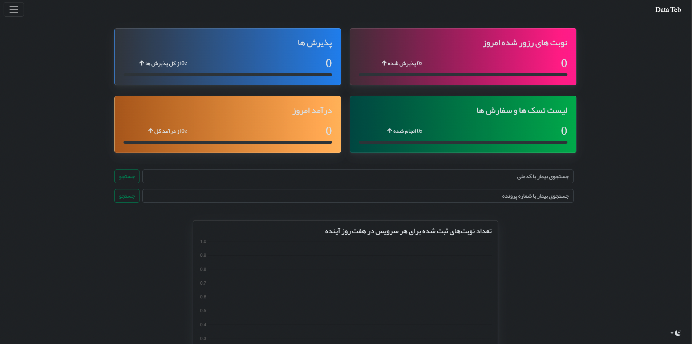
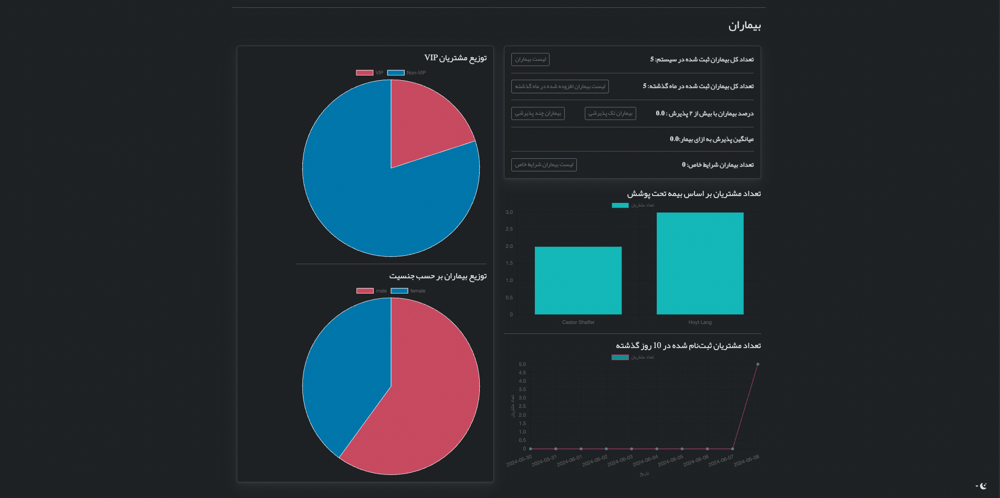

# MediAdmin - Clinic Management System

## Release 1.0.0

### Overview

Welcome to the first official release of MediAdmin, a comprehensive Clinic Management System designed to streamline operations in medical clinics. Built using Django, MediAdmin provides an efficient, secure, and user-friendly platform for managing clinic activities including patient records, appointments, staff management, and more.




### Key Features

#### 1. Patient Management
- **Patient Registration:** Easy-to-use forms for registering new patients.
- **Patient Records:** Maintain detailed records including personal information, medical history, and visit logs.
- **Search and Filter:** Quickly find patient records using advanced search and filter options.

#### 2. Appointment Scheduling
- **Appointment Booking:** Schedule, reschedule, and cancel appointments with ease.
- **Calendar View:** Visualize appointments with an intuitive calendar interface.
- **Reminders:** Automated email reminders for upcoming appointments.

#### 3. Staff Management
- **User Roles:** Define roles and permissions for different staff members including doctors, nurses, and administrative staff.
- **Staff Directory:** Manage staff profiles and contact information.

#### 4. Billing and Invoicing
- **Invoice Generation:** Generate detailed invoices for patient visits and treatments.
- **Payment Tracking:** Track payments and outstanding balances.
- **Reports:** Generate financial reports for accounting and analysis.

#### 5. Security and Compliance
- **User Authentication:** Secure login with Django’s built-in authentication system.
- **Permissions Management:** Fine-grained control over user permissions and access.
- **Data Encryption:** Protect sensitive data with advanced encryption methods.

#### 6. Data Analytics
- **Dashboards:** Visual dashboards displaying key metrics and clinic performance.
- **Reports:** Generate reports on various aspects of clinic operations including patient demographics, appointment statistics, and financial performance.




### Technical Highlights

- **Django Framework:** Leveraging Django’s robust framework for a scalable and maintainable application.
- **Responsive Design:** Fully responsive interface ensuring usability across desktops, tablets, and mobile devices.
- **API Integration:** RESTful APIs for integrating with external systems and services.
- **Celery and Redis:** Asynchronous task management with Celery and Redis for background processing.
- **PostgreSQL:** Reliable and powerful database management with PostgreSQL.

### Installation and Setup

To get started with MediAdmin, follow these steps:

1. **Clone the Repository:**
   ```bash
   git clone https://github.com/yamamoto-tsunetomo/MediAdmin.git
   cd MediAdmin
   ```

2. **Set Up Virtual Environment:**
   ```bash
   python3 -m venv env
   source env/bin/activate
   ```

3. **Run Docker-compose:**
   ```bash
   docker-compose -f docker-compose-stage.yml up --build 
   ```

4. **Create a Superuser:**
   ```bash
   docker-compose -f docker-compose-stage.yml exec backend sh -c "python manage.py createsuperuser"
   ```

6. **Access the Application:**
   Open your browser and navigate to `http://localhost` to access MediAdmin.

### Contributing

We welcome contributions from the community! To contribute, please fork the repository, create a new branch, and submit a pull request with your changes. Ensure your code follows our contribution guidelines and is well-documented.

### Feedback and Support

We value your feedback and are here to help. If you encounter any issues or have suggestions for improvement, please create an issue on our GitHub repository or contact our support team.

Thank you for choosing MediAdmin. We are excited to support your clinic’s journey towards efficient and effective management.